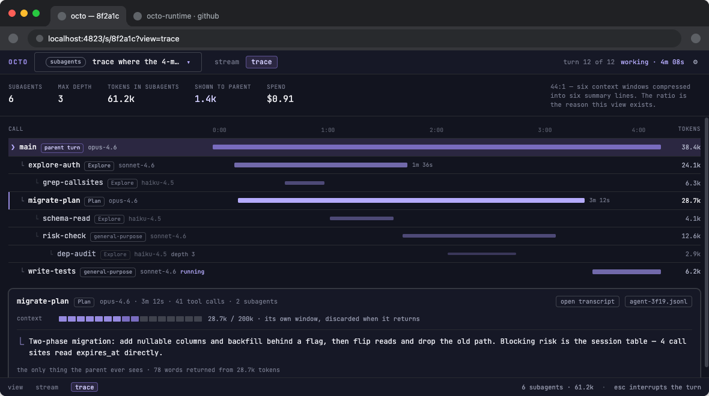
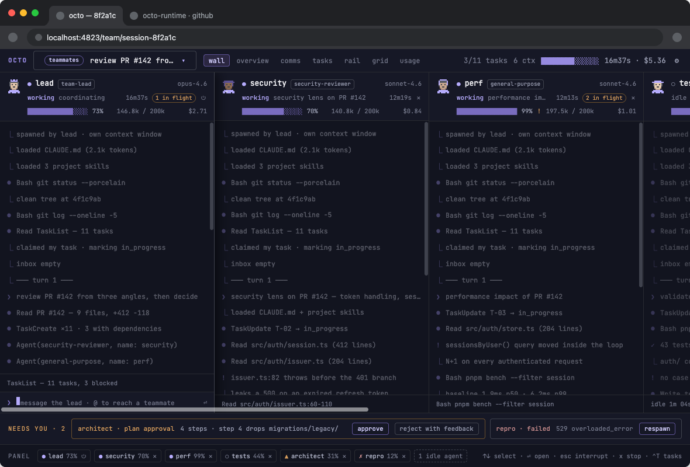
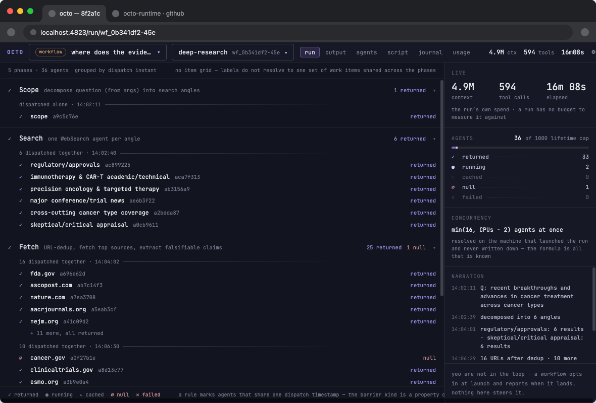

<h1 align="center">Team</h1>

<p align="center">A live browser console for Claude Code, one screen for any session:
solo, running subagents, coordinating a team of teammates, or driving a workflow.</p>

## The problem

Running more than one Claude Code session at a time means tabbing between
terminals: one window per teammate, another for the workflow, another for
whatever you started solo. Coordinating a team that way is worse than running
one agent alone: nothing tells you who's burning context, who's blocked, or
what's waiting on you, until you go look. Team8 is the cockpit for a team's
actual state, in one screen.


It starts itself the moment Claude spawns a team or a workflow, nothing to run
by hand. From there, the switcher in the header lists every other session on the
machine too, solo ones included, so you can hop to any of them without leaving
the browser.

## Native Claude Code, on one screen

None of this is new capability. Agent teams, subagents, workflows and the shared
task list are all native to Claude Code. Team8 just gives what's already
happening a shared screen.

Every teammate keeps its own conversation and transcript, team8 just puts them
side by side. Every task carries a model tier (`opus`, `sonnet` or `haiku`) and
an effort sized to the work by whoever created it, plus real `blockedBy`
dependencies, so finishing one task unblocks whatever was waiting on it. The
lead, meaning you, can message any teammate directly, ask it to wrap up or
stop, or answer a permission prompt, without switching back to a terminal.

## Three modes, one screen

What's running decides the mode. A bare session is subagents mode, two or more
teammates make it a team, and a `Workflow` call gets its own mode with no
roster at all.

### Subagents mode

Any single Claude Code session, no team required. This is the mode for solo
work, or a session driving ordinary subagents (`Explore`, parallel search
agents, and the like).

<table>
<tr>
<td rowspan="2" width="360"></td>
<td><code>stream</code></td>
<td>that session's own live transcript</td>
</tr>
<tr>
<td><code>trace</code></td>
<td>a timeline of every subagent it dispatched: model, elapsed, tokens, cost, nested by call depth (shown once it has spawned at least one)</td>
</tr>
</table>

### Teammate mode

An agent team, two or more members.

<table>
<tr>
<td rowspan="3" width="360"></td>
<td><code>wall</code></td>
<td>one transcript column per teammate, lead pinned on the left</td>
</tr>
<tr>
<td><code>overview</code></td>
<td>a generated brief, where the work stands, and one row per agent: the task it claimed, what it's doing now, what it last reported</td>
</tr>
<tr>
<td><code>comms</code></td>
<td>an <code>everyone</code> room carrying the whole team's traffic, with per-pair inbox threads below it</td>
</tr>
<tr>
<td></td>
<td><code>tasks</code></td>
<td>the shared task list, model, dependencies, state</td>
</tr>
<tr>
<td></td>
<td><code>rail</code></td>
<td>a keyboard-navigable agent list with one big transcript</td>
</tr>
<tr>
<td></td>
<td><code>grid</code></td>
<td>six panes at once, for a wide monitor</td>
</tr>
<tr>
<td></td>
<td><code>usage</code></td>
<td>spend by model, cache-hit ratio, cost per task and per hour</td>
</tr>
</table>

Across the bottom, `NEEDS YOU` collects everything blocked on a human.

### Workflow mode

A `Workflow` tool run. Its agents never join a team roster, so this mode has
no comms and no composer, just the run.

<table>
<tr>
<td rowspan="3" width="360"></td>
<td><code>run</code></td>
<td>agents grouped by phase</td>
</tr>
<tr>
<td><code>agents</code></td>
<td>the ephemeral roster</td>
</tr>
<tr>
<td><code>script</code></td>
<td>the persisted script, with the resume model drawn on it</td>
</tr>
<tr>
<td></td>
<td><code>journal</code></td>
<td>each agent's actual return value, <code>null</code> included</td>
</tr>
<tr>
<td></td>
<td><code>usage</code></td>
<td>the run's token occupancy against what it actually billed</td>
</tr>
</table>

## Install

Three steps on a new machine, then restart:

```bash
claude plugin marketplace add alan-oliv/team8
claude plugin install team8@team8
# then, inside Claude Code:
/team8:setup
```

`/team8:setup` is namespaced to the plugin on purpose, the bare `/setup` works
too until some other plugin also ships one. Same reasoning as `/team8:console`
below.

Needs Node 22+ and `curl`, which you already have if Claude Code runs, on
macOS or Linux.

`/team8:setup` writes the two things a plugin manifest has nowhere to put: an
`env` var that turns on agent teams (`CLAUDE_CODE_EXPERIMENTAL_AGENT_TEAMS`)
and one that turns on the task list (`CLAUDE_CODE_ENABLE_TODO_TOOLS`), one list
shared by the whole team, each entry claimed and closed by whichever teammate
picks it up. It merges into your existing `settings.json` without touching
anything already there, and shows you exactly what it's about to write before
it writes anything.

Restart Claude Code afterwards: `env` is read once at session start.

Check it any time with `/team8:console` (`/console` also works, same as
`/team8:setup` above): it reports whether the console is running, prints its
URL, and starts it if a team is live but the server is down.

## Skills

Three skills fire on their own, when the work calls for them.

`team8:plan` takes an idea to an approved spec with you, then a planner
teammate writes the plan and the task list while a reviewer teammate checks it
as it takes shape. What comes back to you is the task table and a file path,
and nothing runs until you say so.

`team8:tasks` sets the contract a task needs before it's handed off: a
description that stands alone, real `blockedBy` dependencies, and a
`model`/`effort` sized to the work.

`team8:run` turns settled work into tasks and teammates: how many teammates,
the dispatch contract, and the branch shape the dependency graph implies.

A fourth is a plain toggle. Claude doesn't reach for it on its own, you call it
by name: `/team8:enable-team true` or `/team8:enable-team false` flips the
same two `env` vars `/team8:setup` writes.

Don't want Claude reaching for one of these on its own? Turn it off per skill,
no plugin changes needed, in `~/.claude/settings.json` (or the project's
`.claude/settings.json`):

```json
{ "skillOverrides": { "team8:tasks": "off" } }
```

`off` hides it entirely, `user-invocable-only` keeps it reachable by name
(`/team8:tasks`) but out of Claude's own judgement.
