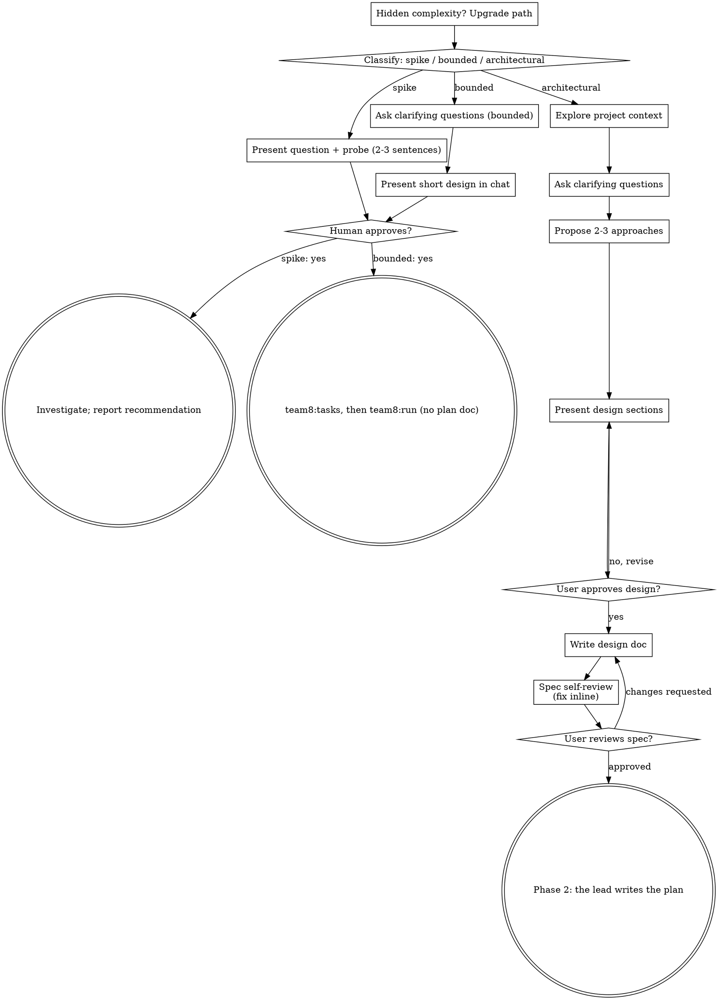

# Plan

## Overview

Three phases. Phase 1 and the plan-writing half of 2 are superpowers'
brainstorming and writing-plans, verbatim. team8 begins where the plan
becomes tasks: tracks and a task list, a run log, and the user's approval
before anything runs.

1. **Brainstorm** — the lead turns the idea into an approved spec, in dialogue with the user.
2. **Plan** — the lead writes the plan from this skill's `writing-plans.md` in the same session, skeleton first and then one task at a time, and creates the tasks through `team8:tasks`.
3. **Approve** — the lead shows the task table and asks: adjust, or run. Nothing runs before the user says so.

**Core principle: the plan is written where the user can see it.** The lead
that brainstormed with the user writes the plan in the same session, a task
at a time, with a progress line after each. A separate planner starts without
the conversation, and every question it has becomes a relay round the user
waits on.

**Every batch leaves a run log** at `docs/team8/runs/YYYY-MM-DD-<topic>.md`:
who ran, on what model, how many rounds, what it was estimated at, what it
cost. It is how a past session gets debugged. See The run log below.

## Phase 1: Brainstorm

Help turn ideas into fully formed designs and specs through natural collaborative dialogue.

Start by classifying how much process the request needs, then work
through your path: understand the context, refine the idea, present a
design, and get your human partner's approval.

<HARD-GATE>
Do NOT invoke any implementation skill, write any code, scaffold any
project, or take any implementation action until you have told your
human partner what you intend and they have approved it. This applies
to EVERY task on EVERY path below — the ceremony scales with the task;
the approval gate never does.
</HARD-GATE>

### Three Paths

Before your first question, classify the request and say the
classification out loud — "this looks bounded, so I'll present a short
design here rather than write a spec" — so your human partner can
override it:

- **Spike** — a feasibility question ("can we...", "is it possible...",
  "quick and dirty is fine") whose output is an answer, not code you
  keep. Present the question and what you'll try in 2-3 sentences, get
  a nod, then find out as cheaply as correctness allows. No design
  doc, no spec file. Report findings as a recommendation; anything you
  built stays labeled throwaway.
- **Bounded** — a well-scoped change to code that already exists in
  this repo: a new flag, a small endpoint, a one-file fix.
  Understanding the kind of app is not enough — bounded means the flow
  you are changing is already here to read. If there is no existing
  flow to change, the task is not bounded. Ask the clarifying
  questions that matter, present a short design IN CHAT (a few
  sentences to a few short paragraphs), and STOP. Implementation
  starts only after your human partner says yes to that design — a
  bounded task's approval is as hard a gate as an architectural
  one. No spec file, no implementation plan document.
- **Architectural** — new projects, new subsystems, changes that
  restructure how components fit together or alter interfaces others
  depend on. Follow the full process: questions, approaches, sectioned
  design, written spec, then Phase 2.

When in doubt between two paths, take the heavier one. The ratchet is
one-way: hidden complexity discovered mid-task upgrades the path —
stop, say so, and step up. Nothing downgrades mid-task.

### Anti-Pattern: "Too Simple To Need Approval"

Every path ends with your human partner approving your intent before
implementation. A todo list, a single-function utility, a config
change — the design may be two sentences in chat, but you MUST present
it and get approval. "Simple" tasks are where unexamined assumptions
cause the most wasted work. What scales with simplicity is the
artifact, never the approval.

**Never offer to skip this skill.** "This is small enough that the
pipeline is overkill, want me to just write it?" is not a question to
ask — the user invoked `team8:plan`, and a small task is the solo mode
with a two-line design, not a reason to bypass the tasks, the table, the
approval and the run. The same holds when the folder is not a git repo:
say so once, skip the branch cut and every commit, and do everything
else exactly as written.

### Red Flags

| Thought | Reality |
|---------|---------|
| "This is too simple to need a design" | Simple means a short design, not no design. Two sentences in chat, then approval. |
| "I'll call it bounded and skip the spec" | Reaching for a label to skip work IS the doubt — take the heavier path. |
| "It's bounded and the design is obvious — I'll start while they read it" | The gate is the approval, not the design's length. Present, then stop until you hear yes. |
| "I understand this kind of app, so it's bounded" | Bounded measures the repo, not your familiarity. A new project has no existing flow — it is architectural. |
| "The spike works, so I'll keep the code" | A spike's output is an answer. Keeping the code is a new request — classify it. |
| "It grew, but I'm almost done — no need to re-classify" | Hidden complexity upgrades the path mid-task. Stop and say so. |
| "They approved the spike, so the follow-up change is approved too" | Each task gets its own classification and its own approval. |
| "This is small enough that team8:plan is overkill — I'll offer to write it directly" | The user chose the pipeline by invoking it. Small means `mode: solo`, never no tasks and no approval. |
| "No git repo, so the branch and run log can't happen — I'll just do the work" | Only the branch cut and the commits depend on git. Tasks, table, approval and run do not. |
| "Same job on 20 files — I'll write one script and run it" | One operation over many inputs is a fan-out: batches plus a verify step, run as a workflow. Do not ask the user to choose between a script and agents. |

### Checklist

Classify first, announce the path, then create a task for each item on
your path and complete them in order.

**Spike:**
1. **Explore project context** — enough to frame the probe
2. **Present question + probe plan** — 2-3 sentences
3. **Get approval** — a nod is enough
4. **Investigate** — as cheaply as correctness allows
5. **Report findings** — a recommendation; label anything built as throwaway

**Bounded:**
1. **Explore project context** — check files, docs, recent commits
2. **Ask clarifying questions** — one at a time, the ones that matter
3. **Present short design in chat** — approach, files touched, testing
4. **Get approval** — STOP and wait for an explicit yes; presenting the design and starting in the same breath is skipping the gate
5. **Implement** — hand the work to `team8:tasks`, then `team8:run`; no plan document

**Architectural:**
1. **Explore project context** — check files, docs, recent commits
2. **Offer the visual companion just-in-time** — NOT upfront. The first time a question would genuinely be clearer shown than described, offer it then (its own message); on approval its browser tab opens for you. If no visual question ever arises, never offer it. See the Visual Companion section below.
3. **Ask clarifying questions** — one at a time, understand purpose/constraints/success criteria
4. **Propose 2-3 approaches** — with trade-offs and your recommendation
5. **Present design** — in sections scaled to their complexity, get user approval after each section
6. **Write design doc** — save to `docs/team8/specs/YYYY-MM-DD-<topic>-design.md` and commit
7. **Spec self-review** — quick inline check for placeholders, contradictions, ambiguity, scope (see below)
8. **User reviews written spec** — ask user to review the spec file before proceeding
9. **Transition to Phase 2** — the lead writes the plan

### Process Flow



**Terminal states are path-bound.** Architectural: the ONLY thing that
follows brainstorming is Phase 2 — never frontend-design, mcp-builder, or
any other implementation skill. Bounded: after approval, the work goes to
`team8:tasks` and then `team8:run`; no plan document. Spike: the terminal
state is a reported recommendation.

### The Process

The subsections below serve the bounded and architectural paths (a
spike stops at "present the probe, get a nod"). Sections from
**Exploring approaches** onward are architectural-path depth — for
bounded work, context plus a few questions plus a short in-chat design
is the whole process.

**Understanding the idea:**

- Check out the current project state first (files, docs, recent commits)
- Before asking detailed questions, assess scope: if the request describes multiple independent subsystems (e.g., "build a platform with chat, file storage, billing, and analytics"), flag this immediately. Don't spend questions refining details of a project that needs to be decomposed first.
- If the project is too large for a single spec, help the user decompose into sub-projects: what are the independent pieces, how do they relate, what order should they be built? Then brainstorm the first sub-project through the normal design flow. Each sub-project gets its own spec → plan → implementation cycle.
- **The same job over many inputs is a fan-out, not a script.** "For each of these N items, produce X" (N of five or more, no decision between items) is workflow-shaped, per the table in `team8:tasks` Mode: the orchestration is the repeatable thing, and it scales to dozens of agents where a lead would improvise the same dispatch by hand. Design it as batches of inputs handled by agents, each returning its result, a verify step over the results, and one aggregation task at the end. The agents do the per-item work — do not offer a choice between agents and a hand-written parser, and do not collapse the job into one script the lead writes. Say the shape out loud in the design so `team8:tasks` reads `workflow` off the graph. If the inputs do not exist yet, stop and ask for them before designing: a fan-out sized on an empty directory is a guess.
- For appropriately-scoped projects, ask questions one at a time to refine the idea
- Prefer multiple choice questions when possible, but open-ended is fine too
- Only one question per message - if a topic needs more exploration, break it into multiple questions
- Focus on understanding: purpose, constraints, success criteria

**Exploring approaches:**

- Propose 2-3 different approaches with trade-offs
- Present options conversationally with your recommendation and reasoning
- Lead with your recommended option and explain why
- YAGNI ruthlessly - remove unnecessary features from every approach and design

**Presenting the design:**

- Once you believe you understand what you're building, present the design
- Scale each section to its complexity: a few sentences if straightforward, up to 200-300 words if nuanced
- Ask after each section whether it looks right so far
- Cover: architecture, components, data flow, error handling, testing
- Be ready to go back and clarify if something doesn't make sense

**Design for isolation and clarity:**

- Break the system into smaller units that each have one clear purpose, communicate through well-defined interfaces, and can be understood and tested independently
- For each unit, you should be able to answer: what does it do, how do you use it, and what does it depend on?
- Can someone understand what a unit does without reading its internals? Can you change the internals without breaking consumers? If not, the boundaries need work.
- Smaller, well-bounded units are also easier for you to work with - you reason better about code you can hold in context at once, and your edits are more reliable when files are focused. When a file grows large, that's often a signal that it's doing too much.

**Working in existing codebases:**

- Explore the current structure before proposing changes. Follow existing patterns.
- Where existing code has problems that affect the work (e.g., a file that's grown too large, unclear boundaries, tangled responsibilities), include targeted improvements as part of the design - the way a good developer improves code they're working in.
- Don't propose unrelated refactoring. Stay focused on what serves the current goal.

### After the Design (architectural path)

**Documentation:**

- Write the validated design (spec) to `docs/team8/specs/YYYY-MM-DD-<topic>-design.md`
  - (User preferences for spec location override this default)
- Use elements-of-style:writing-clearly-and-concisely skill if available
- Commit the design document to git

**Spec Self-Review:**
After writing the spec document, look at it with fresh eyes:

1. **Placeholder scan:** Any "TBD", "TODO", incomplete sections, or vague requirements? Fix them.
2. **Internal consistency:** Do any sections contradict each other? Does the architecture match the feature descriptions?
3. **Scope check:** Is this focused enough for a single implementation plan, or does it need decomposition?
4. **Ambiguity check:** Could any requirement be interpreted two different ways? If so, pick one and make it explicit.

Fix any issues inline. No need to re-review — just fix and move on.

**User Review Gate:**
After the spec review loop passes, ask the user to review the written spec before proceeding:

> "Spec written and committed to `<path>`. Please review it and let me know if you want to make any changes before we start writing out the implementation plan."

Wait for the user's response. If they request changes, make them and re-run the spec review loop. Only proceed once the user approves.

**Implementation:**

- Go to Phase 2. Do NOT invoke any other skill; the lead writes the plan with this skill's `writing-plans.md`.

### Visual Companion

A browser-based companion for showing mockups, diagrams, and visual options during brainstorming. Available as a tool — not a mode. Accepting the companion means it's available for questions that benefit from visual treatment; it does NOT mean every question goes through the browser.

**Offering the companion (just-in-time):** Do NOT offer it upfront. Wait until a question would genuinely be clearer shown than told — a real mockup / layout / diagram question, not merely a UI *topic*. The first time that happens, offer it then, as its own message:
> "This next part might be easier if I show you — I can put together mockups, diagrams, and comparisons in a browser tab as we go. It's still new and can be token-intensive. Want me to? I'll open it for you."

**This offer MUST be its own message.** Only the offer — no clarifying question, summary, or other content. Wait for the user's response. If they accept, start the server with `--open` so their browser opens to the first screen automatically. If they decline, continue text-only and don't offer again unless they raise it.

**Per-question decision:** Even after the user accepts, decide FOR EACH QUESTION whether to use the browser or the terminal. The test: **would the user understand this better by seeing it than reading it?**

- **Use the browser** for content that IS visual — mockups, wireframes, layout comparisons, architecture diagrams, side-by-side visual designs
- **Use the terminal** for content that is text — requirements questions, conceptual choices, tradeoff lists, A/B/C/D text options, scope decisions

A question about a UI topic is not automatically a visual question. "What does personality mean in this context?" is a conceptual question — use the terminal. "Which wizard layout works better?" is a visual question — use the browser.

If they agree to the companion, read the detailed guide before proceeding:
this skill's `visual-companion.md` (beside this file; its `scripts/` sit next to it)

## Phase 2: Plan

The lead writes the plan in this session. Planning is solo: nothing is
spawned — no teammate, no subagent — until the user approves the task table
in Phase 3.

**Before writing:** cut the batch branch — `git checkout -b <topic>` — so
the plan and the tasks land on it and `team8:run` finds it checked out. Open
the run log from the template below, fill the Brainstorm section, and commit
it on the branch. **Not a git repo?** Say so in one line, write the run log
and plan as files anyway, and skip the branch and every commit from here to
the close — nothing else in Phases 2 and 3 changes.

Read this skill's `writing-plans.md` top to bottom, then write the plan
exactly as it says:

1. **Skeleton, one Write:** header, Global Constraints, file structure, and
   every task's `### Task N: <title>` heading with its `Files` and
   `Interfaces` blocks. No steps yet. Tell the user
   `Plan ░░░░░░░ 0/7 · skeleton written`, one cell per task.
2. **One Edit per task, in order,** adding that task's steps. After each, one
   line to the user: `Plan ▓▓▓░░░░ 3/7 · Task 3: <title>`. The console's plan
   tab counts the same thing from the file.
3. **Self-review inline:** writing-plans' three checks, fixed in place. No
   subagent.
4. **Tasks through `team8:tasks`,** as writing-plans' "Create the Tasks" says,
   including the two checks `team8:tasks` runs before its closing.

**Code in the plan is written, not run.** No builds, prototypes or scratch
code while planning. If a step rests on something unproven, ask the user;
settling it is a spike in Phase 1, not work in Phase 2.

## Phase 3: Approve

<HARD-GATE>
Nothing executes until the user has read the task table and said start. An
approved plan is not an approved run.
</HARD-GATE>

1. **Fill the Plan section of the run log** — self-review fixes, task and
   track counts, the estimate total — and **commit the plan and the log** on
   the batch branch, so every executor can read them.
2. **Close with the `team8:tasks` ending**: the plan path, the table (task,
   blocked by, model, estimate) with its total, the notes (the mode and its
   reason per `team8:tasks` Mode, tracks, what starts now, sizing you were
   unsure about, any residual ruling), and the one ask —
   adjust models, adjust tasks, or start the work. `AskUserQuestion` where
   available, multiSelect on. Adjusting a model re-prices its row; show the
   new total.
3. **Adjust** edits the task list and, where it changes the plan, the plan
   file. Show the table again and ask again.
4. On **start the work**, invoke `team8:run` in the stated mode. The tasks and
   the branch exist; `run` skips its own task creation and branch cut.

## The run log

One file per batch, `docs/team8/runs/YYYY-MM-DD-<topic>.md`, on the batch
branch, so it lands with the PR and a past batch can be read back next to
its spec, its plan and its diff. Phase 2 opens it, Phase 3 fills the Plan
section, `team8:run` fills the Run section at close. Numbers are the ones
you have at the time; a line you cannot fill yet stays as its placeholder
until the phase that can.

```markdown
# Run log — <topic>

spec: docs/team8/specs/<file>.md
plan: docs/team8/plans/<file>.md
branch: <branch>
pr: <url, at close>

## Brainstorm
- path: spike | bounded | architectural
- spec rounds with the user: <n>

## Plan
- plan: written by the lead · self-review fixes: <n> (a batch that skipped this skill: `plan: none · tasks from <Jira | Linear | the user> via team8:tasks`)
- tasks: <n> · tracks: <n> · waves: <n> · peak: <n> at once · mode: solo | subagents | teammates | workflow — <reason>
- estimate: ≈$<total> (per task in the plan's table)

## Run
- executors: <name> · <model> · <effort> · track <X> · wave <n>, one line each · peak <n> at once
- track reviews: <X> <n>/3 rounds, one entry each · residuals: <n>
- actual: ≈$<total> · per agent: <name> ≈$<n>, one entry each
- estimate vs actual: <one line>
- went wrong / change next time: <one line each, or "nothing">
```

## Common mistakes

| Mistake | Fix |
|---|---|
| Dispatching a planner or reviewer teammate | The lead writes the plan in this session. A separate planner starts without the conversation, and every question becomes a relay round the user waits on |
| The whole plan in one Write | Skeleton first, then one Edit per task, so the user and the console see it fill in |
| Building or running the plan's code "to be sure" | Code in the plan is written, not run. Unproven means ask the user; it's a Phase 1 spike |
| A review subagent on the plan | Self-review inline. Superpowers measured subagent plan review: twice the time, same quality |
| Writing the plan before the user approved the spec | The hard gate is the approval, not the spec's length |
| Invoking `run` because the plan looks done | Only the user approves the run |
| Plan sections that say "similar to Task N" | Repeat the code. Implementers read one section, out of order |
| Tracks decided in `run` | They are decided when the tasks are created, with file ownership. `run` counts them |
| Run log left for "after" | After is when the numbers are gone. Fill each section in the phase that has them |
