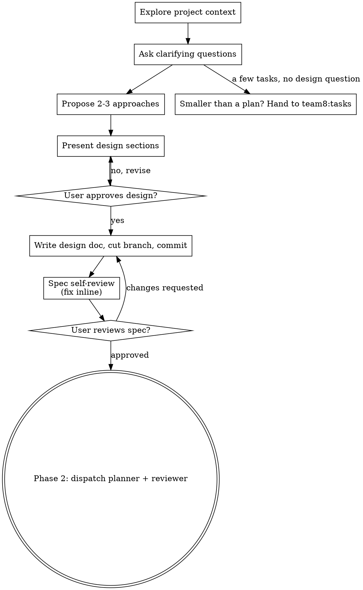

# Plan

## Overview

Three phases. The lead owns the ones that touch the human; teammates own the
document.

1. **Shape** — the lead turns the idea into an approved spec, in dialogue with the user.
2. **Plan** — a planner teammate explores the code and writes the plan and the task list from this skill's `writing-plans.md`; a reviewer teammate checks the skeleton, then the full plan; they iterate between themselves.
3. **Approve** — the lead shows the task table and asks: adjust, or run. Nothing runs before the user says so.

**Core principle: the lead's context is for the user, not for the plan.** A plan
that executes across context-free teammates is the largest document in the flow.
It is written by a teammate, reviewed by a different teammate, and reaches the
lead as a task table and a file path.

**Not for:** one task, or a few tasks with no design decision in them.
`team8:tasks` covers that.

## Phase 1: Shape

Help turn ideas into fully formed designs and specs through natural collaborative dialogue.

Understand the context, refine the idea, present a design, and get your
human partner's approval. Every request that reaches this skill takes the
full path; the design may be short, the approval never is.

<HARD-GATE>
Do NOT invoke any implementation skill, write any code, scaffold any
project, or take any implementation action until you have told your
human partner what you intend and they have approved it. The ceremony scales with the task;
the approval gate never does.
</HARD-GATE>

### Anti-Pattern: "Too Simple To Need Approval"

Phase 1 ends with your human partner approving your intent before
implementation. A todo list, a single-function utility, a config
change — the design may be two sentences in chat, but you MUST present
it and get approval. "Simple" tasks are where unexamined assumptions
cause the most wasted work. What scales with simplicity is the
artifact, never the approval.

### Red Flags

| Thought | Reality |
|---------|---------|
| "This is too simple to need a design" | Simple means a short design, not no design. Two sentences in chat, then approval. |
| "The design is obvious — I'll start while they read it" | The gate is the approval, not the design's length. Present, then stop until you hear yes. |
| "They approved the design, so the spec is approved too" | The spec is a second gate. They read the file before Phase 2 starts. |
| "It grew, but I'm almost done — no need to say so" | Hidden complexity changes the design. Stop, say so, and go back to the section it changes. |

### Checklist

Announce the phase, then create a task for each item and complete them in
order.

1. **Explore project context** — check files, docs, recent commits
2. **Ask clarifying questions** — one at a time, understand purpose/constraints/success criteria
3. **Propose 2-3 approaches** — with trade-offs and your recommendation
4. **Present design** — in sections scaled to their complexity, get user approval after each section
5. **Write design doc** — save to `docs/team8/specs/YYYY-MM-DD-<topic>-design.md`, cut the batch branch, commit it there
6. **Spec self-review** — quick inline check for placeholders, contradictions, ambiguity, scope (see below)
7. **User reviews written spec** — ask user to review the spec file before proceeding
8. **Transition to Phase 2** — dispatch planner and reviewer

### Process Flow

**The terminal state is Phase 2.** The only thing that follows an approved
spec is dispatching the planner — never frontend-design, mcp-builder, or any
other implementation skill. If the questions reveal work smaller than a plan
(a few tasks, no design decision), say so and hand it to `team8:tasks`
instead; the ratchet also runs the other way, and complexity discovered later
brings it back here.

### The Process

**Understanding the idea:**

- Check out the current project state first (files, docs, recent commits)
- Before asking detailed questions, assess scope: if the request describes multiple independent subsystems (e.g., "build a platform with chat, file storage, billing, and analytics"), flag this immediately. Don't spend questions refining details of a project that needs to be decomposed first.
- If the project is too large for a single spec, help the user decompose into sub-projects: what are the independent pieces, how do they relate, what order should they be built? Then brainstorm the first sub-project through the normal design flow. Each sub-project gets its own spec → plan → implementation cycle.
- For appropriately-scoped projects, ask questions one at a time to refine the idea
- Prefer multiple choice questions when possible, but open-ended is fine too
- Only one question per message - if a topic needs more exploration, break it into multiple questions
- Focus on understanding: purpose, constraints, success criteria

**Exploring approaches:**

- Propose 2-3 different approaches with trade-offs
- Present options conversationally with your recommendation and reasoning
- Lead with your recommended option and explain why
- YAGNI ruthlessly - remove unnecessary features from every approach and design

**Presenting the design:**

- Once you believe you understand what you're building, present the design
- Scale each section to its complexity: a few sentences if straightforward, up to 200-300 words if nuanced
- Ask after each section whether it looks right so far
- Cover: architecture, components, data flow, error handling, testing
- Be ready to go back and clarify if something doesn't make sense

**Design for isolation and clarity:**

- Break the system into smaller units that each have one clear purpose, communicate through well-defined interfaces, and can be understood and tested independently
- For each unit, you should be able to answer: what does it do, how do you use it, and what does it depend on?
- Can someone understand what a unit does without reading its internals? Can you change the internals without breaking consumers? If not, the boundaries need work.
- Smaller, well-bounded units are also easier for you to work with - you reason better about code you can hold in context at once, and your edits are more reliable when files are focused. When a file grows large, that's often a signal that it's doing too much.

**Working in existing codebases:**

- Explore the current structure before proposing changes. Follow existing patterns.
- Where existing code has problems that affect the work (e.g., a file that's grown too large, unclear boundaries, tangled responsibilities), include targeted improvements as part of the design - the way a good developer improves code they're working in.
- Don't propose unrelated refactoring. Stay focused on what serves the current goal.

### After the Design

**Documentation:**

- Write the validated design (spec) to `docs/team8/specs/YYYY-MM-DD-<topic>-design.md`
  - (User preferences for spec location override this default)
- Cut the batch branch now — `git checkout -b <topic>` — and commit the design document on it. The plan lands on the same branch in Phase 3, and `team8:run` finds it checked out

**Spec Self-Review:**
After writing the spec document, look at it with fresh eyes:

1. **Placeholder scan:** Any "TBD", "TODO", incomplete sections, or vague requirements? Fix them.
2. **Internal consistency:** Do any sections contradict each other? Does the architecture match the feature descriptions?
3. **Scope check:** Is this focused enough for a single implementation plan, or does it need decomposition?
4. **Ambiguity check:** Could any requirement be interpreted two different ways? If so, pick one and make it explicit.

Fix any issues inline. No need to re-review — just fix and move on.

**User Review Gate:**
After the spec review loop passes, ask the user to review the written spec before proceeding:

> "Spec written and committed to `<path>`. Please review it and let me know if you want to make any changes before we start writing out the implementation plan."

Wait for the user's response. If they request changes, make them and re-run the spec review loop. Only proceed once the user approves.

**Implementation:**

- Go to Phase 2. Do NOT invoke any other skill; the planner teammate writes the plan.

**Already have a spec?** If the user points at one, Phase 1 collapses to the
Spec Self-Review, the branch cut and the commit above, then Phase 2. Do not
re-brainstorm a settled design.

## Phase 2: Plan

Spawn both teammates in one message. Never pass `isolation: "worktree"` — it
spawns a subagent, not a teammate, and a subagent has no task tools and no
mailbox. Verify both names in `~/.claude/teams/<team>/config.json` right after:
`jq -r '.members[].name' ~/.claude/teams/<team>/config.json`.

Both run on the top tier at high effort. The plan is the contract every
downstream task consumes, and the review is what everything downstream builds
on. This is not the place to save a model tier.

Both dispatches name this skill's `writing-plans.md` by absolute path. Resolve
it from this skill's directory before composing the prompts.

### The planner's dispatch

> You are **planner**. Read `<absolute path to writing-plans.md>` first, top to
> bottom — it is how the plan gets written, and it ends with how the tasks get
> created and how the two checkpoints with reviewer work. Then read
> `<spec path>` — it is the authority; the plan argues from it. Then explore
> the code the spec touches: the files, the patterns they follow, the tests
> beside them, the recent commits. The plan names exact paths and line ranges,
> and copies existing patterns; it cannot do that from the spec alone.
>
> Write the skeleton first — header, global constraints, file structure,
> tracks, and every task's Files and Interfaces blocks with no steps yet —
> save it, and message **reviewer** with the plan path and the spec path
> (checkpoint 1). Keep writing the task steps while reviewer reads; fold its
> skeleton findings in as they arrive. When the plan is complete, run its
> self-review, create the tasks, and message reviewer again with the task
> count (checkpoint 2). Do not implement anything. Do not spawn subagents. Do
> not commit. Files you own: the plan file only. The branch `<branch>` is
> already checked out; do not run `git checkout -b`.

### The reviewer's dispatch

> You are **reviewer**. Read `<absolute path to writing-plans.md>` first — it
> is the format and the rules the plan has to meet. You are read-only: touch no
> file. Do not spawn subagents. Do not implement.
>
> **Checkpoint 1 — the skeleton.** When **planner** messages you a plan path,
> read the spec and the plan. Run checks 1, 3 and 4 below on what is there,
> and check the file structure against the code: open the files the plan
> names and confirm the paths, the line ranges and the patterns it says it
> copies. Message planner the findings now; a wrong decomposition is cheap
> to fix before the task steps exist and expensive after.
>
> **Checkpoint 2 — the full plan.** When planner messages the task count,
> read the plan again and the task list (`TaskList`, then `TaskGet` on each).
> Run every check, and write the result of each even when clean:
>
> 1. **Spec coverage.** Every requirement in the spec → the task that implements
>    it. A requirement with no task is Blocking.
> 2. **Placeholders.** Every pattern in the No Placeholders section. Each is
>    Blocking.
> 3. **Interface consistency.** A table: every pair of tasks where one consumes
>    what the other produces — the two tasks, the produced name and type, the
>    consumed name and type, match or mismatch. A mismatch is Blocking.
> 4. **Tracks.** A table: every pair of tasks that touch the same file — same
>    track or different tracks. Different tracks sharing a file is Blocking:
>    they will run in parallel in one checkout. A file missing from the Tracks
>    table is Blocking.
> 5. **Blockers.** Every `blockedBy` names something the blocked task reads. Every
>    consumes/produces pair from check 3 has a blocker. A blocker with no read is
>    Minor; a missing blocker is Blocking.
> 6. **Sizing.** Model matches the description's verbs per `team8:tasks`:
>    mechanical → haiku, standard → sonnet, judgment → opus. A judgment task on
>    haiku is Blocking; the rest is Minor.
> 7. **Standalone descriptions.** No task description points at a conversation.
>    Every one names its plan section, its track and its owned files. Missing is
>    Blocking.
> 8. **One to one.** Task count and subjects match the plan.
> 9. **Right-sizing.** A task a reviewer could not reject on its own, or a step
>    that is more than one action, is Minor.
>
> Message planner the findings, each labelled Blocking or Minor with the task
> number and the fix. Re-check after each revision, scoped to the findings and
> the changelog line. Three rounds maximum after checkpoint 2. When no Blocking
> finding remains, or after round three, message the lead: `APPROVED` or
> `RESIDUALS`, the plan path, the task count, the tracks, and any open finding
> with both sides in one line each.

### While they run

Stay free. Relay one line per checkpoint and per round to the user. If planner asks a question
only the spec's author can answer, answer it from the spec or ask the user —
never guess on their behalf. If the reviewer reports `RESIDUALS`, rule on each
open finding yourself: apply it via planner, or state why the plan stands. Do
not edit the plan in the lead session.

## Phase 3: Approve

<HARD-GATE>
Nothing executes until the user has read the task table and said start. An
approved plan is not an approved run.
</HARD-GATE>

1. **Ask both teammates to stop.** The plan file is the memory. Executors are
   fresh teammates that `team8:run` dispatches.
2. **Commit the plan** on the batch branch cut in Phase 1, so every executor
   can read it.
3. **Close with the `team8:tasks` ending**: the plan path, the table (task,
   blocked by, model, estimate) with its total, the notes (tracks, what starts
   now, sizing you were unsure about, any residual ruling), and the one ask —
   adjust models, adjust tasks, or start the work. `AskUserQuestion` where
   available, multiSelect on. Adjusting a model re-prices its row; show the
   new total.
4. **Adjust** edits the task list and, where it changes the plan, the plan
   file. Show the table again and ask again.
5. On **start the work**, invoke `team8:run`. The tasks and the branch exist;
   `run` skips its own task creation and branch cut.

## Common mistakes

| Mistake | Fix |
|---|---|
| Lead writes the plan itself "to save a spawn" | The plan is the biggest document in the flow. It goes to planner |
| Planner and reviewer as subagents | Subagents cannot message each other; every round would pass through the lead. Teammates |
| Invoking `run` because the reviewer said APPROVED | The reviewer approves the plan. Only the user approves the run |
| Planner writes all task steps before reviewer sees the skeleton | Checkpoint 1 exists so decomposition errors cost minutes, not the whole plan |
| Planner writes from the spec without opening the code | Paths, line ranges and patterns come from the repo. Explore first |
| Dispatching planner before the user approved the spec | The hard gate is the approval, not the spec's length |
| Reviewer told what not to flag | Let it flag; rule on it in the residuals |
| Plan sections that say "similar to Task N" | Repeat the code. Implementers read one section, out of order |
| Tracks decided in `run` | They are decided here, in the plan, with file ownership. `run` counts them |
| Planner keeps running as "plan owner" during execution | The plan file answers executor questions. Stop both teammates before `run` |
| No self-review before the first reviewer round | Round one should be about judgment, not typos |
| Dispatch prompts say "read writing-plans.md" without a path | A teammate cannot find this skill's directory. Absolute path |
